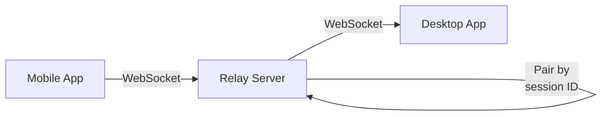

## Workspace Structure

The Jarvis Rust workspace at `jarvis-rs/Cargo.toml` defines **10 crates** with clear separation of concerns:

```toml
[workspace]
members = [
    "crates/jarvis-app",
    "crates/jarvis-common",
    "crates/jarvis-config",
    "crates/jarvis-platform",
    "crates/jarvis-tiling",
    "crates/jarvis-renderer",
    "crates/jarvis-ai",
    "crates/jarvis-social",
    "crates/jarvis-webview",
    "crates/jarvis-relay",
]
```

<Note>
  All crates share a common version (0.1.0) and are published under the MIT license.
</Note>

## Crate Overview

<CardGroup cols={2}>
  <Card title="jarvis-common" icon="foundation">
    Foundation crate with shared types, errors, actions, and event bus
  </Card>
  <Card title="jarvis-config" icon="file-code">
    TOML configuration loading, validation, themes, live reload
  </Card>
  <Card title="jarvis-platform" icon="computer">
    OS abstractions: clipboard, paths, crypto, keybinds
  </Card>
  <Card title="jarvis-tiling" icon="grid-2">
    Binary split tree layout engine and pane management
  </Card>
  <Card title="jarvis-renderer" icon="palette">
    GPU rendering: wgpu, shaders, UI chrome, effects
  </Card>
  <Card title="jarvis-ai" icon="robot">
    AI client implementations: Claude, Gemini, Whisper
  </Card>
  <Card title="jarvis-social" icon="users">
    Social features: presence, chat, channels, identity
  </Card>
  <Card title="jarvis-webview" icon="window">
    WebView management: wry wrapper, IPC, content provider
  </Card>
  <Card title="jarvis-app" icon="rocket">
    Application shell: window, event loop, IPC dispatch
  </Card>
  <Card title="jarvis-relay" icon="server">
    Standalone WebSocket relay for mobile-desktop bridging
  </Card>
</CardGroup>

---

## jarvis-common

**Type**: Library  
**Dependencies**: None (foundation crate)  
**Path**: `jarvis-rs/crates/jarvis-common/src/lib.rs`

The foundation crate with zero internal-crate dependencies. Defines the shared vocabulary used across all other crates.

### Key Modules

<Accordion>
  <AccordionItem title="actions">
    **`Action` enum** - Every user-triggerable action (47 variants)
    
    Examples:
    - `NewPane`
    - `ClosePane`
    - `FocusPane { index: usize }`
    - `ResizePane { direction: ResizeDirection, delta: i32 }`
    - `ZoomPane`
    - `OpenCommandPalette`
    - `OpenAssistant`
    - `ReloadConfig`
    - `Quit`
    
    Keybinds, command palette, CLI, and IPC all resolve to an `Action`.
    
    **`ResizeDirection` enum** - Left, Right, Up, Down for resize and swap operations.
  </AccordionItem>
  
  <AccordionItem title="events">
    **`Event` enum** - Broadcast events for pub/sub coordination:
    
    ```rust
    pub enum Event {
        ConfigReloaded,
        PaneOpened { id: PaneId },
        PaneClosed { id: PaneId },
        PaneFocused { id: PaneId },
        PresenceUpdate,
        ChatMessage,
        Notification(Notification),
        Shutdown,
    }
    ```
    
    **`EventBus`** - Wrapper around `tokio::sync::broadcast::Sender<Event>` with publish/subscribe API. Capacity of 256 events.
  </AccordionItem>
  
  <AccordionItem title="types">
    Core data types used throughout the system:
    
    - **`Rect`** - `{x, y, width, height}` as `f64` for viewport and pane bounds
    - **`PaneId`** - Newtype wrapper `PaneId(u32)`
    - **`PaneKind`** - Enum: `Terminal`, `Assistant`, `Chat`, `WebView`, `ExternalApp`
    - **`AppState`** - Enum: `Starting`, `Running`, `ShuttingDown`
    - **`Color`** - RGBA color with hex/rgba string parsing
  </AccordionItem>
  
  <AccordionItem title="errors">
    Error hierarchy using `thiserror`:
    
    - **`JarvisError`** - Top-level error type
    - **`ConfigError`** - Configuration loading/validation errors
    - **`PlatformError`** - OS-specific operation failures
  </AccordionItem>
  
  <AccordionItem title="notifications">
    In-app toast notifications:
    
    - **`Notification`** - Toast with level (Info/Warning/Error), title, body, TTL
    - **`NotificationQueue`** - Bounded FIFO queue (default 16) with auto-eviction of expired notifications
  </AccordionItem>
  
  <AccordionItem title="id">
    ID generation utilities:
    
    - **`new_id()`** - UUID v4 generator
    - **`new_correlation_id()`** - UUID v4 for request correlation
    - **`SessionId`** - Newtype for session identifiers
  </AccordionItem>
</Accordion>

---

## jarvis-config

**Type**: Library  
**Dependencies**: `jarvis-common`  
**Path**: `jarvis-rs/crates/jarvis-config/src/lib.rs`

Manages the entire configuration lifecycle with TOML parsing, theme support, plugin discovery, validation, and live reload.

### Key Features

- **25+ config sections** as strongly-typed structs with serde defaults
- **Built-in themes** with selective field overrides
- **Plugin discovery** from `{config_dir}/jarvis/plugins/`
- **File system watcher** for live config reload
- **Validation** of colors, ranges, constraints
- **TOML round-trip** (read and write)

### Main Entry Point

```rust
use jarvis_config::load_config;

let config = load_config().expect("failed to load config");
println!("Theme: {}", config.theme.name);
println!("Font size: {}", config.font.size);
```

The `load_config()` function:
1. Loads TOML from platform config directory
2. Applies selected theme
3. Discovers local plugins
4. Validates all fields
5. Returns `JarvisConfig`

### Config Sections

<Accordion>
  <AccordionItem title="schema::JarvisConfig">
    Root config type with these sections:
    
    - `theme` - Theme name and overrides
    - `colors` - Primary/accent/background colors
    - `font` - Family, size, weight, ligatures
    - `terminal` - Shell, cursor style, scrollback
    - `shell` - Command and environment variables
    - `window` - Decorations, opacity, blur
    - `effects` - Scanlines, vignette, bloom, glow
    - `layout` - Panel gap, border radius, padding
    - `opacity` - Transparency for each layer
    - `background` - Mode (hex_grid/gradient/solid/image/video)
    - `visualizer` - Orb configuration and state overrides
    - `startup` - Boot animation settings
    - `voice` - Push-to-talk and audio settings
    - `keybinds` - Key combinations mapped to actions
    - `panels` - Panel-specific settings
    - `games` - Game configuration
    - `livechat` - Chat room settings
    - `presence` - Social presence server config
    - `performance` - Preset and optimization settings
    - `updates` - Auto-update configuration
    - `logging` - Log level and targets
    - `advanced` - Experimental features
    - `auto_open` - Auto-open panes on startup
    - `status_bar` - Status bar content templates
    - `relay` - Mobile relay server settings
    - `plugins` - Plugin configuration
  </AccordionItem>
  
  <AccordionItem title="theme">
    **Built-in themes**:
    - `jarvis-dark` (default)
    - `ayu-mirage`
    - `catppuccin-mocha`
    - `tokyo-night`
    - `nord`
    
    Themes selectively override config fields via `ThemeOverrides`.
  </AccordionItem>
  
  <AccordionItem title="validation">
    Validates:
    - Color formats (hex strings)
    - Font sizes (8-72)
    - Opacity ranges (0.0-1.0)
    - Layout constraints (gap, padding, max panels)
    - Background settings
    - Visualizer parameters
  </AccordionItem>
  
  <AccordionItem title="watcher::ConfigWatcher">
    File system watcher (via `notify` crate) for live config reload:
    
    ```rust
    let watcher = ConfigWatcher::new(config_path, event_bus)?;
    // Automatically triggers Action::ReloadConfig on file change
    ```
  </AccordionItem>
</Accordion>

---

## jarvis-platform

**Type**: Library  
**Dependencies**: `jarvis-common`, `jarvis-config`  
**Path**: `jarvis-rs/crates/jarvis-platform/src/lib.rs`

OS-level abstractions and platform services.

### Key Modules

<Accordion>
  <AccordionItem title="input::KeybindRegistry">
    Maps key combinations to actions:
    
    ```rust
    let registry = KeybindRegistry::from_config(&config.keybinds);
    
    let key_combo = KeyCombo {
        ctrl: true,
        alt: false,
        shift: false,
        super_key: false,
        key: "t".to_string(),
    };
    
    if let Some(action) = registry.lookup(&key_combo) {
        println!("Action: {:?}", action);
    }
    ```
    
    Supports:
    - Forward lookup (key combo → action)
    - Reverse lookup (action → display string)
    - Platform-specific normalization (Cmd on macOS = Ctrl elsewhere)
  </AccordionItem>
  
  <AccordionItem title="input_processor::InputProcessor">
    Stateful processor between winit keyboard events and the app:
    
    ```rust
    pub enum InputResult {
        Action(Action),
        TerminalInput(Vec<u8>),
        Consumed,
    }
    ```
    
    Tracks current `InputMode`:
    - `Terminal` - Default mode, encodes keys for PTY
    - `CommandPalette` - Filter/select actions
    - `Assistant` - Chat input
    - `Settings` - Settings panel navigation
    
    Encoding module converts key names to terminal escape sequences (VT100/xterm).
  </AccordionItem>
  
  <AccordionItem title="clipboard::Clipboard">
    Cross-platform clipboard access via `arboard`:
    
    ```rust
    let mut clipboard = Clipboard::new()?;
    clipboard.set_text("Hello, world!")?;
    let text = clipboard.get_text()?;
    ```
  </AccordionItem>
  
  <AccordionItem title="paths">
    Resolves OS-standard directories:
    
    - `config_dir()` - `~/.config/jarvis/` (Linux/macOS) or `%APPDATA%/jarvis/` (Windows)
    - `data_dir()` - `~/.local/share/jarvis/`
    - `cache_dir()` - `~/.cache/jarvis/`
    - `log_dir()` - `{data_dir}/logs/`
    - `crash_report_dir()` - `{data_dir}/crash_reports/`
    - `identity_file()` - `{data_dir}/identity.json`
    
    `ensure_dirs()` creates all directories with proper permissions.
  </AccordionItem>
  
  <AccordionItem title="crypto::CryptoService">
    Full cryptographic identity service:
    
    **Key Management**:
    - Persistent ECDSA P-256 signing key (message authentication)
    - Persistent ECDH P-256 key pair (key exchange)
    - Key handle store (opaque u32 references to in-memory keys)
    - Identity persistence to JSON file with PKCS#8 DER encoding
    
    **Operations**:
    - AES-256-GCM symmetric encryption/decryption
    - PBKDF2-HMAC-SHA256 room key derivation
    - ECDH shared key derivation
    - Message signing and verification
    
    **Fingerprint**:
    First 8 bytes of SHA-256 of the ECDSA public key SPKI DER
    
    ```rust
    let crypto = CryptoService::load_or_generate(identity_path)?;
    let fingerprint = crypto.fingerprint();
    println!("Identity: {}", hex::encode(fingerprint));
    ```
  </AccordionItem>
  
  <AccordionItem title="crash_report">
    Writes structured crash reports on panic:
    
    ```rust
    jarvis_platform::crash_report::install();
    // On panic, writes to {crash_report_dir}/crash-{timestamp}.json
    ```
    
    Report includes:
    - Backtrace
    - Platform info (OS, arch)
    - Sanitized paths
    - Timestamp
  </AccordionItem>
</Accordion>

---

## jarvis-tiling

**Type**: Library  
**Dependencies**: `jarvis-common`  
**Path**: `jarvis-rs/crates/jarvis-tiling/src/lib.rs`

A pure-logic tiling window manager with no platform dependencies. See [Tiling System](/architecture/tiling-system) for complete documentation.

### Core Types

```rust
// Binary split tree
pub enum SplitNode {
    Leaf { pane_id: u32 },
    Split {
        direction: Direction,
        ratio: f64,
        first: Box<SplitNode>,
        second: Box<SplitNode>,
    },
}

// Horizontal (left/right) or Vertical (top/bottom)
pub enum Direction {
    Horizontal,
    Vertical,
}

// Central coordinator
pub struct TilingManager {
    tree: SplitNode,
    panes: HashMap<u32, Pane>,
    stacks: HashMap<u32, PaneStack>,
    focused: u32,
    zoomed: Option<u32>,
    layout_engine: LayoutEngine,
    next_id: u32,
}
```

### Operations

- `split()` - Split focused pane horizontally or vertically
- `close_focused()` - Remove focused pane and collapse tree
- `focus_next()` / `focus_prev()` - Cycle focus through panes
- `focus_direction()` - Move focus in a direction
- `zoom_toggle()` - Toggle fullscreen mode for focused pane
- `resize()` - Adjust split ratio by keyboard
- `swap()` - Swap focused pane with neighbor
- `compute_layout()` - Convert tree to pixel rectangles

---

## jarvis-renderer

**Type**: Library  
**Dependencies**: `jarvis-common`, `jarvis-config`, `jarvis-platform`  
**Path**: `jarvis-rs/crates/jarvis-renderer/src/lib.rs`

GPU rendering via `wgpu` (cross-platform Vulkan/Metal/DX12). See [Renderer](/architecture/renderer) for complete documentation.

### Key Components

<Accordion>
  <AccordionItem title="gpu::GpuContext">
    Wraps wgpu resources:
    - `Instance` - GPU abstraction
    - `Adapter` - Physical GPU device
    - `Device` - Logical device handle
    - `Queue` - Command submission queue
    - `Surface` - Window surface for presentation
    - `SurfaceConfiguration` - Format, present mode, size
  </AccordionItem>
  
  <AccordionItem title="render_state::RenderState">
    Core rendering state:
    - `gpu: GpuContext`
    - `quad: QuadRenderer` - Colored rectangles for UI chrome
    - `bg_pipeline: BackgroundPipeline` - Hex grid background shader
    - `uniforms: GpuUniforms` - Shared GPU uniform buffer
    
    Per-frame render order:
    1. Clear + hex grid background
    2. UI chrome quads (tab bar, status bar, active tab highlight)
  </AccordionItem>
  
  <AccordionItem title="background::BackgroundPipeline">
    Full-screen shader pipeline for animated hex grid:
    - Hexagonal grid with edge glow
    - 2D simplex noise modulation
    - Slow pulse oscillation
    - Configurable color and opacity
  </AccordionItem>
  
  <AccordionItem title="quad::QuadRenderer">
    Instanced quad renderer:
    - Uploads up to 256 rectangles per frame
    - Single draw call
    - Used for tab bar, status bar, borders
  </AccordionItem>
  
  <AccordionItem title="boot_screen">
    Boot animation with:
    - Sweeping scan line
    - Corner brackets
    - Vignette
    - Progress bar
    - Status messages
  </AccordionItem>
  
  <AccordionItem title="command_palette::CommandPalette">
    Fuzzy command search:
    - Action list filtering
    - URL input mode
    - Keybind display
  </AccordionItem>
</Accordion>

---

## jarvis-ai

**Type**: Library  
**Dependencies**: `jarvis-common`  
**Path**: `jarvis-rs/crates/jarvis-ai/src/lib.rs`

AI provider clients with a unified interface.

### Trait

```rust
#[async_trait]
pub trait AiClient: Send + Sync {
    async fn send_message(
        &self,
        messages: &[Message],
        tools: &[ToolDefinition],
    ) -> Result<AiResponse, AiError>;

    async fn send_message_streaming(
        &self,
        messages: &[Message],
        tools: &[ToolDefinition],
        on_chunk: Box<dyn Fn(String) + Send + Sync>,
    ) -> Result<AiResponse, AiError>;
}
```

### Providers

<CardGroup cols={3}>
  <Card title="Claude" icon="c">
    `ClaudeClient` - Claude API with SSE streaming
  </Card>
  <Card title="Gemini" icon="g">
    `GeminiClient` - Google Gemini API
  </Card>
  <Card title="Whisper" icon="microphone">
    `WhisperClient` - OpenAI Whisper transcription
  </Card>
</CardGroup>

### Features

- **Streaming** - SSE stream parsing for real-time responses
- **Tool calling** - Function definitions and execution
- **Session management** - Multi-turn conversations with tool-call loops
- **Token tracking** - Cumulative usage across providers
- **Skill routing** - Route user intents to appropriate provider

---

## jarvis-social

**Type**: Library  
**Dependencies**: `jarvis-common`  
**Path**: `jarvis-rs/crates/jarvis-social/src/lib.rs`

Social features: presence, chat, identity, and experimental collaboration.

### Core Features

<Accordion>
  <AccordionItem title="presence::PresenceClient">
    WebSocket client for presence server:
    
    ```rust
    let client = PresenceClient::connect(config).await?;
    
    while let Some(event) = client.recv().await {
        match event {
            PresenceEvent::UserOnline { user } => {
                println!("{} is online", user.username);
            }
            PresenceEvent::ChatMessage { from, message } => {
                println!("{}: {}", from, message);
            }
            _ => {}
        }
    }
    ```
    
    Events:
    - `Connected`
    - `UserOnline` / `UserOffline`
    - `ActivityChanged`
    - `Poked`
    - `ChatMessage`
    - `Disconnected`
    - `Error`
  </AccordionItem>
  
  <AccordionItem title="chat::ChatHistory">
    Message storage:
    - `ChatMessage` with timestamp, sender, content
    - `ChatHistory` with append/search/clear
    - `ChatHistoryConfig` for storage location
  </AccordionItem>
  
  <AccordionItem title="channels::ChannelManager">
    Chat channel management:
    - Create/join/leave channels
    - Per-channel message history
    - User lists per channel
  </AccordionItem>
  
  <AccordionItem title="identity::Identity">
    User identity generation:
    - `user_id` (UUID)
    - `display_name` (configurable)
    - `fingerprint` (from crypto service)
  </AccordionItem>
</Accordion>

### Experimental Features

<Warning>
  The following features are behind the `experimental-collab` feature flag and may change.
</Warning>

- **`pair`** - Pair programming sessions with `PairManager`, `PairSession`, `PairRole`
- **`voice`** - Voice chat rooms with `VoiceManager`, `VoiceRoom`, `VoiceConfig`
- **`screen_share`** - Screen sharing with `ScreenShareManager`, `ShareQuality`

---

## jarvis-webview

**Type**: Library  
**Dependencies**: `jarvis-common`  
**Path**: `jarvis-rs/crates/jarvis-webview/src/lib.rs`

WebView lifecycle management and IPC bridge via `wry`.

### Key Components

<Accordion>
  <AccordionItem title="manager::WebViewRegistry">
    High-level wrapper mapping `pane_id: u32` → `WebViewHandle`:
    
    ```rust
    let mut registry = WebViewRegistry::new();
    
    let config = WebViewConfig {
        url: "jarvis://localhost/terminal/index.html",
        transparent: true,
        ipc_handler: Some(Box::new(|pane_id, message| {
            println!("IPC from pane {}: {}", pane_id, message);
        })),
    };
    
    registry.create(pane_id, &window, config)?;
    registry.get_mut(pane_id).unwrap().set_bounds(rect);
    ```
    
    Methods:
    - `create()` - Create WebView for a pane
    - `get()` / `get_mut()` - Access WebView handle
    - `destroy()` - Destroy WebView
    - `drain_events()` - Poll WebView events
  </AccordionItem>
  
  <AccordionItem title="content::ContentProvider">
    Serves local files via `jarvis://` custom protocol:
    
    - Resolves paths relative to base directory (`assets/panels/`)
    - In-memory overrides for dynamic content
    - Plugin directory resolution (`plugins/{id}/...`)
    - MIME type inference (HTML, CSS, JS, images, fonts, audio, video, WASM)
    - Directory traversal prevention via canonicalization
  </AccordionItem>
  
  <AccordionItem title="ipc">
    IPC message types:
    
    ```rust
    pub struct IpcMessage {
        pub kind: String,
        pub payload: IpcPayload,
    }
    
    pub enum IpcPayload {
        Text(String),
        Json(Value),
        None,
    }
    ```
    
    **IPC Init Script** - JavaScript injected into every WebView:
    - `window.jarvis.ipc.send(kind, payload)` - Send message to Rust
    - `window.jarvis.ipc.on(kind, handler)` - Register handler
    - `window.jarvis.ipc.request(kind, payload)` - Promise-based request/response
    - Keyboard shortcut forwarder (intercepts Cmd+key)
    - Clipboard API polyfill
    - Command palette overlay system
  </AccordionItem>
  
  <AccordionItem title="theme_bridge">
    Generates CSS custom properties from config theme:
    
    ```css
    :root {
      --jarvis-primary: #cba6f7;
      --jarvis-background: #1e1e2e;
      --jarvis-font-size: 13px;
      /* ... */
    }
    ```
    
    Injected into all WebViews on startup and config reload.
  </AccordionItem>
</Accordion>

---

## jarvis-relay

**Type**: Binary (`jarvis-relay`)  
**Dependencies**: None (standalone)  
**Path**: `jarvis-rs/crates/jarvis-relay/src/main.rs`

A standalone WebSocket relay server for mobile-to-desktop bridging.

### Architecture



### Features

- **Session pairing** - Desktop and mobile clients pair by session ID
- **Message relay** - Forwards messages between paired clients
- **Rate limiting** - Per-IP connection limiting and total session caps
- **Stale session reaping** - Removes inactive sessions
- **E2E encryption** - Never inspects message payloads (encrypted by `CryptoService`)

### Modules

- `connection` - WebSocket connection handling
- `protocol` - Wire protocol for relay messages
- `session::SessionStore` - Active session management
- `rate_limit::RateLimiter` - Connection throttling

### Usage

```bash
# Run relay server
jarvis-relay --port 8080 --host 0.0.0.0

# Desktop connects with session ID
# Mobile scans QR code and connects with same session ID
# Relay forwards messages between them
```

---

## jarvis-app

**Type**: Binary (`jarvis`)  
**Dependencies**: All other crates (except `jarvis-relay`)  
**Path**: `jarvis-rs/crates/jarvis-app/src/main.rs`

The main application binary. Wires everything together.

### Entry Point

```rust
fn main() -> Result<()> {
    // 1. Load environment
    load_dotenv();
    install_panic_hook();
    
    // 2. Parse CLI
    let args = cli::parse();
    
    // 3. Initialize logging
    tracing_subscriber::init();
    
    // 4. Load config
    let config = jarvis_config::load_config()?;
    
    // 5. Ensure directories
    jarvis_platform::paths::ensure_dirs()?;
    
    // 6. Build keybind registry
    let registry = KeybindRegistry::from_config(&config.keybinds);
    
    // 7. Create event loop
    let event_loop = EventLoop::new()?;
    let mut app = JarvisApp::new(config, registry);
    
    // 8. Enter event loop
    event_loop.run_app(&mut app)?;
    
    Ok(())
}
```

### App State Modules (21 sub-modules)

<Accordion>
  <AccordionItem title="core.rs">
    `JarvisApp` struct definition with all fields
  </AccordionItem>
  
  <AccordionItem title="event_handler.rs">
    `impl ApplicationHandler for JarvisApp` (winit event loop integration)
  </AccordionItem>
  
  <AccordionItem title="init.rs">
    Window creation, GPU renderer init, WebView setup, crypto identity loading
  </AccordionItem>
  
  <AccordionItem title="dispatch.rs">
    Action dispatch: routes `Action` enum variants to subsystem calls
  </AccordionItem>
  
  <AccordionItem title="shutdown.rs">
    Ordered shutdown: PTYs → WebViews → presence → relay → tokio runtime → GPU
  </AccordionItem>
  
  <AccordionItem title="polling.rs">
    Adaptive polling at ~120Hz for presence, assistant, WebView, PTY, mobile, relay, menu events
  </AccordionItem>
  
  <AccordionItem title="pty_bridge/">
    PTY process management via `portable-pty`. Spawns shell processes, manages reader threads, bridges I/O between xterm.js and PTY
  </AccordionItem>
  
  <AccordionItem title="webview_bridge/" >
    13 sub-modules handling all WebView-related operations:
    - `ipc_dispatch.rs` - IPC message validation and routing
    - `lifecycle.rs` - WebView creation/destruction
    - `bounds.rs` - Coordinate conversion and bounds sync
    - `pty_handlers.rs` - PTY input/resize/restart IPC handlers
    - `presence_handlers.rs` - Presence user list and poke forwarding
    - `settings_handlers.rs` - Settings panel IPC
    - `assistant_handlers.rs` - AI assistant input/output
    - `crypto_handlers.rs` - Crypto operations proxied from WebView JS
    - `file_handlers.rs` - File read operations
    - `theme_handlers.rs` - Theme CSS injection
    - `status_bar_handlers.rs` - Status bar initialization
  </AccordionItem>
</Accordion>

---

## Next Steps

<CardGroup cols={2}>
  <Card title="Renderer" icon="palette" href="/architecture/renderer">
    Deep dive into GPU rendering pipeline
  </Card>
  <Card title="Tiling System" icon="grid-2" href="/architecture/tiling-system">
    Binary split tree and layout engine
  </Card>
  <Card title="Configuration" icon="sliders" href="/configuration/overview">
    TOML configuration reference
  </Card>
  <Card title="Building" icon="hammer" href="/advanced/build-from-source">
    Build from source
  </Card>
</CardGroup>
