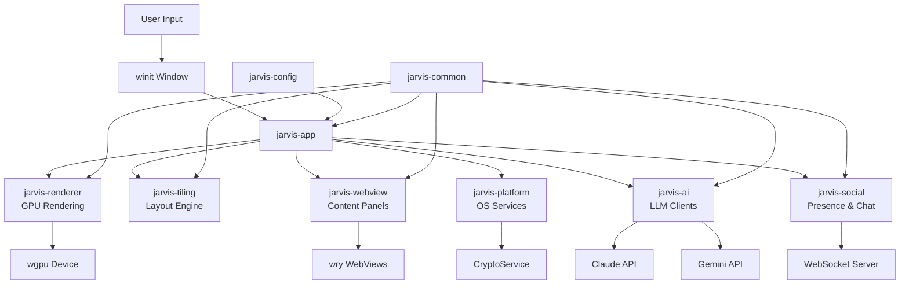
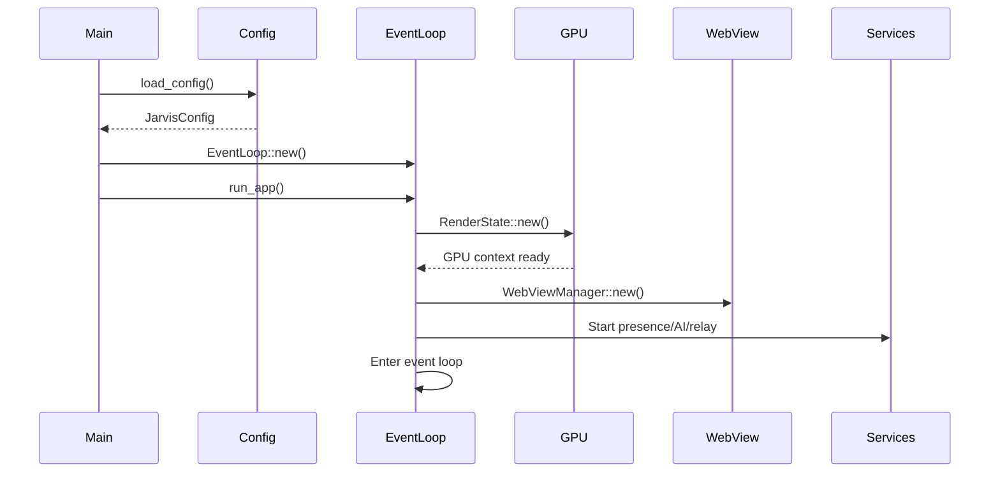
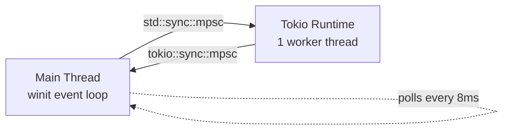
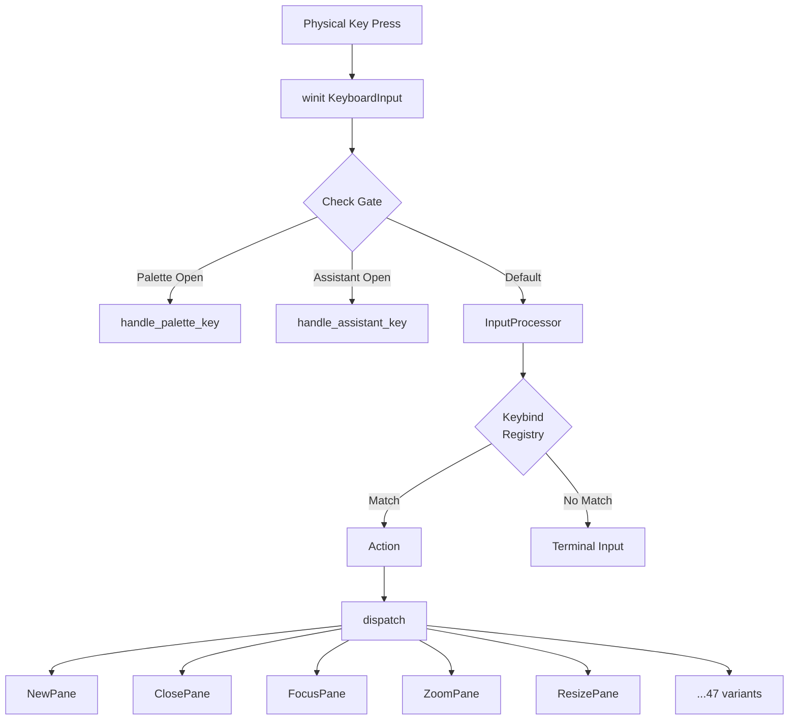
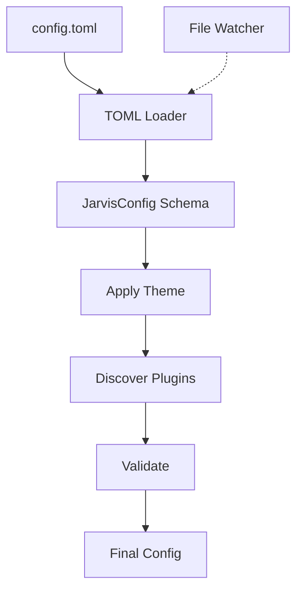

## What is Jarvis?

Jarvis is a **GPU-accelerated desktop environment** that combines terminal emulation, AI chat assistants, retro arcade games, live social chat, and a configurable visual effects system into a single tiled window. Built entirely in Rust, it leverages modern GPU rendering, WebView embedding, and cross-platform abstractions to deliver a sci-fi inspired computing experience.

<CardGroup cols={2}>
  <Card title="Terminal Emulation" icon="terminal">
    Embedded xterm.js with native PTY processes
  </Card>
  <Card title="AI Assistants" icon="robot">
    Claude and Gemini streaming APIs with tool calling
  </Card>
  <Card title="Tiling Manager" icon="grid-2">
    Binary split tree with split/zoom/resize/swap
  </Card>
  <Card title="GPU Rendering" icon="cube">
    wgpu-powered hex grid backgrounds and visual effects
  </Card>
</CardGroup>

## Core Features

- **Tiling window management** with split/zoom/resize/swap operations
- **Embedded terminal emulation** via xterm.js connected to native PTY processes
- **AI assistant panels** backed by Claude and Gemini streaming APIs
- **Live social presence** with WebSocket-based real-time user tracking
- **E2E encrypted chat** with ECDSA identity, ECDH key exchange, and AES-256-GCM
- **Mobile pairing** via a WebSocket relay server with QR code provisioning
- **Plugin system** for custom HTML/JS/CSS panels served via the `jarvis://` protocol
- **TOML-based configuration** with live reload, theme support, and validation

## Repository Structure

The repository contains both the legacy Python/Swift stack and the modern Rust rewrite:

```
jarvis/
  README.md              # Project overview (documents the Python stack)
  main.py                # Legacy Python entry point
  metal-app/             # Legacy Swift/Metal frontend
  skills/                # Legacy Python AI skill system
  voice/                 # Legacy Python audio capture
  connectors/            # Legacy Python service integrations
  jarvis-rs/             # Rust workspace (the rewrite)
    Cargo.toml           # Workspace manifest
    crates/              # All workspace crates
    assets/              # Bundled HTML/JS/CSS panel assets
  docs/                  # Documentation
```

## High-Level System Architecture



## Dependency Graph

The workspace is organized with `jarvis-common` as the foundation:

```
jarvis-common        (foundation -- no internal deps)
    |
    +-- jarvis-config        (depends on: jarvis-common)
    |
    +-- jarvis-tiling        (depends on: jarvis-common)
    |
    +-- jarvis-ai            (depends on: jarvis-common)
    |
    +-- jarvis-social        (depends on: jarvis-common)
    |
    +-- jarvis-webview       (depends on: jarvis-common)
    |
    +-- jarvis-platform      (depends on: jarvis-common, jarvis-config)
    |
    +-- jarvis-renderer      (depends on: jarvis-common, jarvis-config, jarvis-platform)
    |
    +-- jarvis-app           (depends on: ALL of the above)
    |
    jarvis-relay             (standalone -- no internal deps)
```

<Note>
  The dependency hierarchy ensures clean separation: domain-specific crates depend only on `jarvis-common`, while higher-level crates integrate multiple subsystems.
</Note>

## Application Lifecycle

### Startup Sequence



1. **Load environment** - Parse `.env` file and install panic hook
2. **Parse CLI arguments** - Handle `--execute`, `--directory`, `--config`, `--log-level`
3. **Initialize logging** - Set up tracing subscriber with filters
4. **Load configuration** - Load TOML, apply theme, discover plugins, validate
5. **Ensure directories** - Create platform-specific directories
6. **Build keybind registry** - Parse keybind config into lookup table
7. **Create event loop** - Initialize winit event loop
8. **Construct app state** - Create `JarvisApp` with all subsystems
9. **Enter event loop** - Begin processing window events

### Event Loop

The event loop is driven by winit's `ApplicationHandler` trait:

<Accordion title="Event Loop Details">
  <AccordionItem title="resumed()">
    Called once when the window system is ready. Performs all initialization:
    - Create window and GPU surface
    - Initialize render state
    - Set up WebView subsystem
    - Load crypto identity
    - Create native menu bar
    - Show boot screen or default layout
    - Connect to presence and relay servers
  </AccordionItem>
  
  <AccordionItem title="window_event()">
    Handles window-specific events:
    - `CloseRequested` - Triggers shutdown
    - `Resized` - Reconfigures GPU surface, re-syncs WebView bounds
    - `ScaleFactorChanged` - Handles DPI changes
    - `CursorMoved` - Updates cursor icon, handles drag-to-resize
    - `MouseInput` - Pane focus, border dragging, window dragging
    - `ModifiersChanged` - Tracks Ctrl/Alt/Shift/Super state
    - `KeyboardInput` - Routes through input processor
    - `RedrawRequested` - Calls render pipeline
  </AccordionItem>
  
  <AccordionItem title="about_to_wait()">
    Called when event queue is empty. Runs adaptive polling at ~120Hz:
    - Poll presence events
    - Poll assistant events
    - Poll WebView events
    - Poll PTY output
    - Poll mobile commands
    - Poll relay events
    - Poll menu events
    - Request redraw if needed
  </AccordionItem>
</Accordion>

### Shutdown Sequence

Shutdown is triggered by `Action::Quit` or `WindowEvent::CloseRequested`:

1. **Kill all PTY child processes**
2. **Destroy all WebView panels**
3. **Disconnect presence client**
4. **Shut down mobile relay bridge**
5. **Shut down tokio runtime** (cancels background tasks)
6. **Release GPU resources**

<Warning>
  The shutdown order is critical to prevent resource leaks and deadlocks. PTY processes must be killed before WebViews are destroyed.
</Warning>

## Key Design Patterns

### Action Dispatch

All user interactions resolve to an `Action` enum variant. The `dispatch()` method routes actions to subsystem calls:

```
User Input → InputProcessor → Action → dispatch() → Subsystem
```

This decouples input handling from business logic. The same `Action::NewPane` can be triggered by:
- Keybind
- Command palette selection
- IPC message from WebView
- CLI argument

### Event Bus (Broadcast)

The `EventBus` uses `tokio::sync::broadcast` for pub/sub event distribution:

```rust
pub enum Event {
    ConfigReloaded,
    PaneOpened { id: PaneId },
    PaneClosed { id: PaneId },
    PaneFocused { id: PaneId },
    PresenceUpdate,
    ChatMessage,
    Notification(Notification),
    Shutdown,
}
```

This enables loose coupling between subsystems. Any component can subscribe to events without direct dependencies.

### IPC Bridge (Rust ↔ JavaScript)

Bidirectional communication between Rust and WebView JavaScript:

<CodeGroup>
```javascript JavaScript → Rust
// JavaScript calls Rust
window.jarvis.ipc.send('pty_input', { data: 'ls\n' });

// Promise-based request/response
const result = await window.jarvis.ipc.request('get_config', {});
```

```rust Rust → JavaScript
// Rust calls JavaScript
handle.evaluate_script("console.log('Hello from Rust')");

// Structured IPC message
handle.send_ipc("pty_output", json!({ "data": "output" }));
```
</CodeGroup>

All IPC messages are validated against an allowlist of 29 permitted message kinds. Unknown kinds are rejected and logged.

### Custom Protocol (`jarvis://`)

The `ContentProvider` registers a custom protocol with wry:

```
jarvis://localhost/terminal/index.html
  ↓
{assets_dir}/panels/terminal/index.html
```

This avoids the need for a local HTTP server and enables:
- Bundled assets
- In-memory content overrides
- Plugin directory resolution
- Security containment (canonicalization-based traversal prevention)

### Sync/Async Bridge

The main event loop runs synchronously on the main thread (required by winit). Async operations run on a dedicated `tokio::runtime::Runtime`:



Communication uses channels polled at ~120Hz by the main thread.

## Data Flow: Keyboard Input to Action Dispatch



<Tip>
  Most terminal typing never reaches this path. xterm.js in the focused WebView intercepts keystrokes directly and sends `pty_input` IPC messages to Rust.
</Tip>

## Configuration Architecture

The configuration system is layered:



1. **Schema** - 25+ strongly-typed config sections with defaults
2. **TOML Loading** - Reads from platform config directory
3. **Theme Application** - Selectively overrides config fields
4. **Plugin Discovery** - Scans for local plugin directories
5. **Validation** - Checks formats, ranges, constraints
6. **Live Reload** - File watcher triggers config reload

## Legacy Stack vs Rust Rewrite

### Legacy Stack (Python + Swift)

- **Platform**: macOS only (Metal, AppKit)
- **Runtime**: Python 3.10+, Swift 5.9+
- **Components**:
  - `main.py` - Python entry point, mic capture, event loop
  - `metal-app/` - Swift/Metal 3D orb renderer
  - `skills/` - Python AI skill system
  - `voice/` - Audio capture and Whisper transcription
  - `connectors/` - Service integrations

### Rust Rewrite

- **Platform**: Cross-platform (Windows, macOS, Linux)
- **Runtime**: Single native binary
- **Components**: 10 Rust crates with clear responsibilities

| Legacy Component | Rust Replacement |
|-----------------|------------------|
| `metal-app/` (Swift/Metal) | `jarvis-renderer` (wgpu) |
| `main.py` event loop | `jarvis-app` (winit) |
| Metal 3D orb | wgpu hex grid shader |
| Swift chat panels | `jarvis-webview` (wry WebViews) |
| `skills/router.py` | `jarvis-ai::router::SkillRouter` |
| `skills/claude_code.py` | `jarvis-ai::claude::ClaudeClient` |
| `voice/audio.py` | `jarvis-ai::whisper::WhisperClient` |
| None (new) | `jarvis-tiling` (binary split tree) |
| None (new) | `jarvis-config` (TOML + validation) |
| None (new) | `jarvis-platform::CryptoService` |
| None (new) | `jarvis-social` (presence + chat) |
| None (new) | `jarvis-relay` (mobile bridge) |

## Next Steps

<CardGroup cols={2}>
  <Card title="Crates" icon="cube" href="/architecture/crates">
    Detailed documentation of all 10 workspace crates
  </Card>
  <Card title="Renderer" icon="palette" href="/architecture/renderer">
    GPU rendering pipeline and visual effects
  </Card>
  <Card title="Tiling System" icon="grid-2" href="/architecture/tiling-system">
    Binary split tree and layout engine
  </Card>
  <Card title="Configuration" icon="sliders" href="/configuration/overview">
    TOML configuration reference
  </Card>
</CardGroup>
