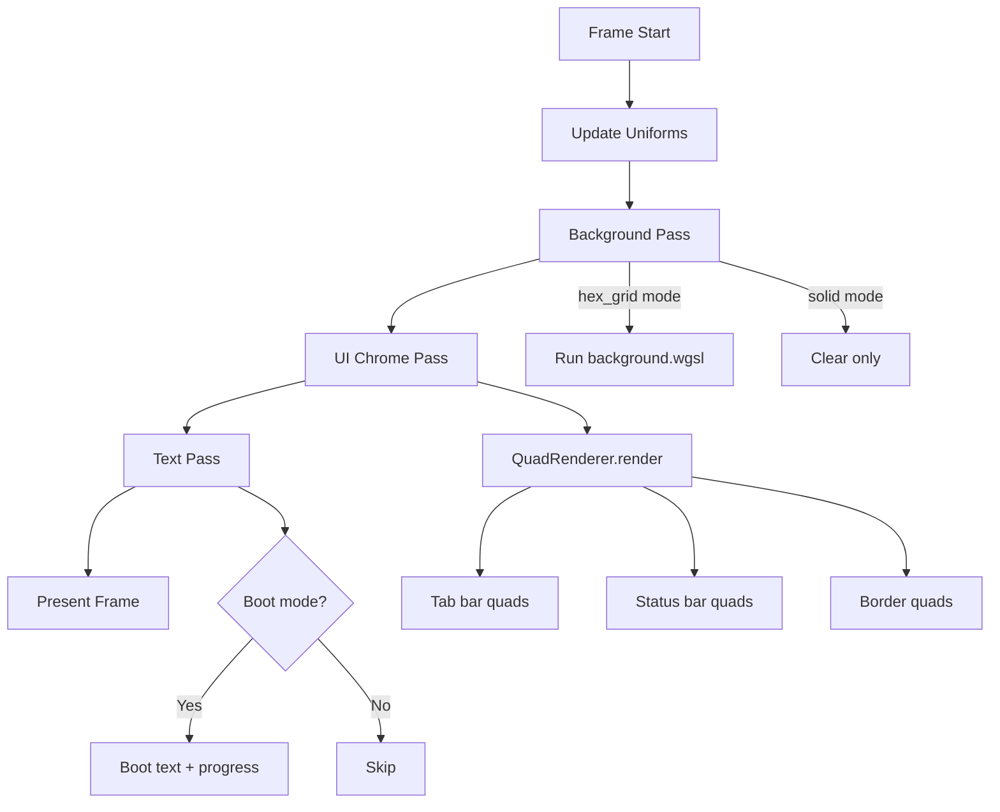
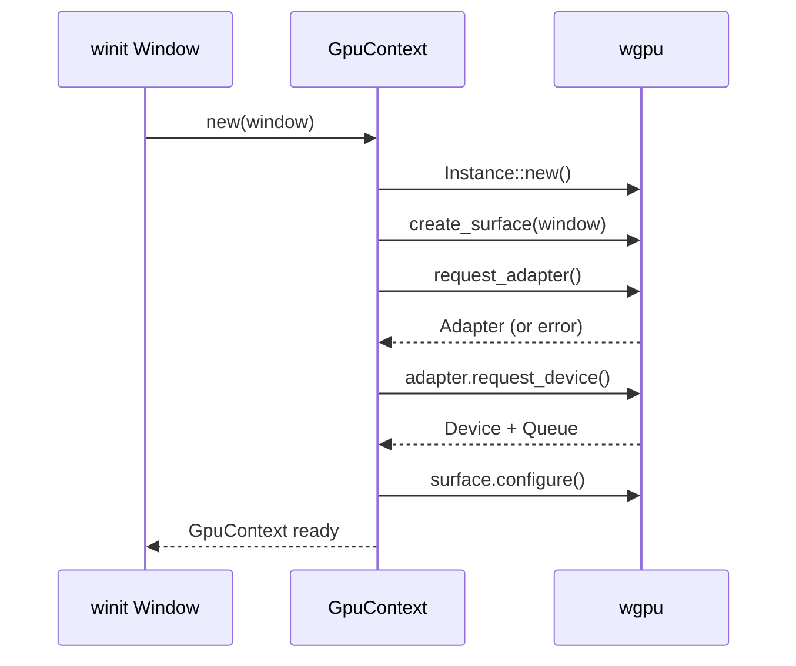
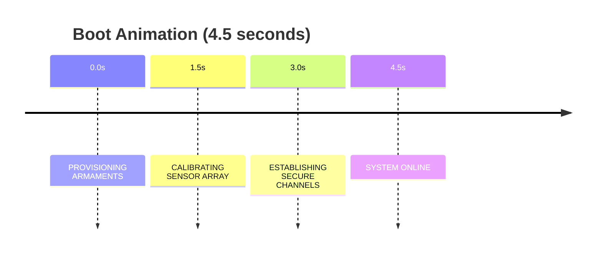

## Overview

Jarvis uses a **fully GPU-accelerated rendering pipeline** built on **wgpu**, the portable Rust graphics API. Every visual element -- the animated hex grid background, glowing pane borders, boot animation scan lines, and CRT scanlines -- is rendered through custom WGSL shaders running on the GPU.

<Info>
  wgpu provides a unified API across Vulkan (Linux/Android), Metal (macOS/iOS), and DirectX 12 (Windows), with fallback to OpenGL/WebGL.
</Info>

## Rendering Pipeline

### Module Structure

```
jarvis-renderer/
  src/
    lib.rs              # Public API re-exports
    gpu/
      context.rs        # wgpu device, queue, surface
      uniforms.rs       # Shared GPU uniform buffer
    background/
      renderer.rs       # Background mode selection
      pipeline.rs       # wgpu pipeline setup
      types.rs          # BackgroundMode enum
      helpers.rs        # Color parsing
    effects/
      renderer.rs       # Per-pane effects
      types.rs          # EffectsConfig
    boot_screen/
      mod.rs            # Boot animation
      types.rs          # BootUniforms, BootScreenConfig
      text.rs           # Text rendering (glyphon)
    quad/
      renderer.rs       # Instanced quad drawing
      types.rs          # QuadInstance, Vertex
      pipeline.rs       # Inline WGSL shader
    ui/
      chrome.rs         # Tab bar, status bar, borders
      layout.rs         # Content area calculation
      types.rs          # Tab, TabBar, StatusBar, PaneBorder
    render_state/
      state.rs          # Core rendering state
      helpers.rs        # Frame logging
    perf.rs             # Frame timing
    assistant_panel.rs  # Chat UI model
    command_palette.rs  # Command search
    shaders/
      background.wgsl   # Hex grid shader
      effects.wgsl      # Per-pane effects
      boot.wgsl         # Boot HUD shader
      text.wgsl         # (placeholder, glyphon internal)
```

### Per-Frame Render Order



## GPU Context

### Initialization



The initialization process:

1. **Create wgpu Instance** with default backends
2. **Create Surface** from winit window handle
3. **Request Adapter** with `HighPerformance` power preference
4. **Request Device** with default limits
5. **Select Surface Format** (prefers `Bgra8UnormSrgb`)
6. **Configure Surface** with vsync (`PresentMode::Fifo`)

### GPU Context Structure

```rust
pub struct GpuContext {
    pub device: wgpu::Device,
    pub queue: wgpu::Queue,
    pub surface: wgpu::Surface<'static>,
    pub surface_config: wgpu::SurfaceConfiguration,
    pub size: PhysicalSize,       // { width: u32, height: u32 }
    pub scale_factor: f64,
}
```

### Error Handling

```rust
pub enum RendererError {
    SurfaceError(String),     // Surface creation/acquisition failure
    AdapterNotFound,          // No GPU adapter (hardware or software)
    DeviceError(String),      // Device request failure (OOM, etc.)
    TextError(String),        // glyphon text rendering errors
}
```

## Background Rendering

### Background Modes

<Accordion>
  <AccordionItem title="hex_grid (default)">
    **Visual appearance**: A dark screen with a faintly glowing hexagonal grid pattern. Individual hex cells fade in and out organically using simplex noise, creating a breathing, living circuit-board aesthetic.
    
    **Implementation**: Rendered in `background.wgsl` via a full-screen triangle:
    
    1. Converts screen UV to aspect-corrected space
    2. Scales to hex grid density of 12x
    3. Computes hex cell coordinates and edge distance
    4. Applies `smoothstep` edge glow
    5. Modulates with 2D simplex noise
    6. Adds global pulse: `0.8 + 0.2 * sin(time * 0.5)`
    
    **Configuration**:
    ```toml
    [background.hex_grid]
    color = "#00d4ff"       # Cyan glow
    opacity = 0.08          # Subtle intensity
    animation_speed = 1.0   # Speed multiplier
    glow_intensity = 0.5    # Glow brightness
    ```
  </AccordionItem>
  
  <AccordionItem title="solid">
    **Visual appearance**: Flat, uniform color filling the entire window.
    
    **Implementation**: Uses wgpu clear color directly -- no shader pass needed.
    
    **Configuration**:
    ```toml
    [background]
    mode = "solid"
    solid_color = "#000000"
    ```
  </AccordionItem>
  
  <AccordionItem title="gradient">
    **Visual appearance**: Smooth color transition between two or more colors, either linear or radial.
    
    **Implementation**: Shader render pass with configurable colors and angle.
    
    **Configuration**:
    ```toml
    [background.gradient]
    type = "radial"                     # linear or radial
    colors = ["#000000", "#0a1520"]
    angle = 180                         # For linear gradients
    ```
  </AccordionItem>
  
  <AccordionItem title="image / video">
    **Status**: Config schema defined, GPU renderer falls back to solid black (future implementation).
    
    **Configuration**:
    ```toml
    [background.image]
    path = "/path/to/image.png"
    fit = "cover"           # cover, contain, fill, tile
    blur = 0                # Gaussian blur radius
    opacity = 1.0
    
    [background.video]
    path = "/path/to/video.mp4"
    loop = true
    muted = true
    fit = "cover"
    ```
  </AccordionItem>
</Accordion>

### Hex Grid Shader Details

<CodeGroup>
```wgsl Vertex Shader
// Full-screen triangle (no vertex buffer)
fn vs_main(@builtin(vertex_index) vertex_index: u32) -> VertexOutput {
    var positions = array<vec2<f32>, 3>(
        vec2<f32>(-1.0, -1.0),  // Bottom left
        vec2<f32>( 3.0, -1.0),  // Bottom right (off-screen)
        vec2<f32>(-1.0,  3.0),  // Top left (off-screen)
    );
    
    let pos = positions[vertex_index];
    var out: VertexOutput;
    out.position = vec4<f32>(pos, 0.0, 1.0);
    out.uv = (pos + 1.0) * 0.5;  // 0..1
    return out;
}
```

```wgsl Fragment Shader
fn fs_main(in: VertexOutput) -> @location(0) vec4<f32> {
    // Aspect-corrected coordinates
    var uv = in.uv * 2.0 - 1.0;
    uv.x *= uniforms.aspect_ratio;
    
    // Hex grid calculation
    let hex_coords = hex_coords(uv * 12.0);
    let dist = hex_dist(hex_coords);
    
    // Edge glow
    let edge = smoothstep(0.45, 0.5, dist);
    
    // Noise modulation
    let noise_val = snoise(hex_coords + uniforms.time * 0.1);
    let cell_brightness = noise_val * 0.5 + 0.5;
    
    // Pulse
    let pulse = 0.8 + 0.2 * sin(uniforms.time * 0.5);
    
    // Final color
    let alpha = edge * cell_brightness * pulse * uniforms.hex_opacity;
    return vec4<f32>(uniforms.hex_color.rgb * alpha, alpha);
}
```
</CodeGroup>

## Visual Effects

### Scanlines

**Visual appearance**: Faint horizontal dark lines overlaid on the screen, mimicking CRT monitor scan lines.

**Implementation**:
```wgsl
let scan_y = in.uv.y * u.screen_height;
let scanline = sin(scan_y * 3.14159265) * 0.5 + 0.5;
color.rgb *= (1.0 - scanline_intensity * (1.0 - scanline));
```

**Configuration**:
```toml
[effects.scanlines]
enabled = true
intensity = 0.08    # 0.0 = off, 1.0 = maximum darkness
```

### Vignette

**Visual appearance**: Gradual darkening around screen edges, drawing the eye toward the center.

**Implementation**:
```wgsl
fn vignette(uv: vec2<f32>) -> f32 {
    let d = distance(uv, vec2<f32>(0.5, 0.5));
    return 1.0 - smoothstep(0.4, 0.9, d) * 0.4;
}
```

**Configuration**:
```toml
[effects.vignette]
enabled = true
intensity = 1.2     # 0.0 = off, up to 3.0 for extreme darkening
```

### Bloom

**Visual appearance**: Soft light bleed around bright elements, giving them a halo of diffused light.

**Implementation**: Multiple blur passes create progressively smoother glow.

**Configuration**:
```toml
[effects.bloom]
enabled = true
intensity = 0.9     # Brightness multiplier (0.0-3.0)
passes = 2          # Blur iterations (1-5)
```

### Active Pane Glow

**Visual appearance**: Colored luminous border around the currently focused pane.

**Implementation**: Signed distance field (SDF) from fragment to pane rectangle:

```wgsl
fn sdf_rect(uv: vec2<f32>) -> f32 {
    let center = (pane_min + pane_max) * 0.5;
    let half_size = (pane_max - pane_min) * 0.5;
    let d = abs(uv - center) - half_size;
    return length(max(d, vec2(0.0))) + min(max(d.x, d.y), 0.0);
}

// Outer glow (outside pane)
if dist > 0.0 && dist < glow_width {
    let glow_alpha = smoothstep(glow_width, 0.0, dist);
    color.rgb += glow_color.rgb * glow_alpha;
}

// Inner highlight (just inside border)
if dist > -glow_width * 0.25 && dist < 0.0 {
    color.rgb += glow_color.rgb * 0.15;
}
```

**Configuration**:
```toml
[effects.glow]
enabled = true
color = "#cba6f7"   # Soft purple
width = 2.0         # Glow spread in pixels (0.0-10.0)
intensity = 0.0     # CSS box-shadow intensity (0.0-1.0)
```

### Inactive Pane Dimming

**Visual appearance**: Unfocused panes appear visually receded with reduced brightness.

**Implementation**:
```wgsl
if u.is_focused < 0.5 && u.dim_factor < 0.999 {
    color = vec4<f32>(color.rgb * u.dim_factor, color.a);
}
```

**Configuration**:
```toml
[effects]
inactive_pane_dim = true
dim_opacity = 0.6   # 0.0 = fully transparent, 1.0 = no dimming
```

### Flicker

**Visual appearance**: Very subtle, rapid brightness oscillation simulating CRT flicker.

**Configuration**:
```toml
[effects.flicker]
enabled = true
amplitude = 0.004   # 0.0 = off, 0.05 = very noticeable
```

## Boot Animation

### Visual Elements

<CardGroup cols={2}>
  <Card title="Sweeping Scan Line" icon="wave-pulse">
    Horizontal bright line that continuously sweeps from top to bottom every 1.2 seconds
  </Card>
  <Card title="Corner Brackets" icon="brackets">
    L-shaped brackets at each corner in accent color
  </Card>
  <Card title="Vignette" icon="circle-half-stroke">
    Edge darkening (40% at corners)
  </Card>
  <Card title="Progress Bar" icon="bars-progress">
    Animated bar with percentage counter
  </Card>
</CardGroup>

### Boot Sequence



### Status Messages (14 messages, cycle every 1.5s)

- PROVISIONING ARMAMENTS
- CALIBRATING SENSOR ARRAY
- ESTABLISHING SECURE CHANNELS
- INITIALIZING NEURAL INTERFACE
- DEPLOYING COUNTERMEASURES
- SYNCHRONIZING THREAT MATRIX
- LOADING TACTICAL OVERLAYS
- VERIFYING BIOMETRIC CLEARANCE
- ACTIVATING PERIMETER DEFENSE
- COMPILING INTELLIGENCE BRIEFS
- SCANNING FREQUENCY SPECTRUM
- ENGAGING QUANTUM ENCRYPTION
- BOOTSTRAPPING CORE SYSTEMS
- **SYSTEM ONLINE**

### Boot Shader

```wgsl
// Sweeping scan line
let scan_line_pos = (uniforms.time % 1.2) / 1.2;  // 0..1 over 1.2s
let scan_y = scan_line_pos * uniforms.screen_height;
let scan_dist = abs(uv.y * uniforms.screen_height - scan_y);

// Core + glow
let core_intensity = smoothstep(2.0, 0.0, scan_dist);
let glow_intensity = smoothstep(20.0, 0.0, scan_dist) * 0.3;

color += accent_color * (core_intensity + glow_intensity);
```

### Configuration

```toml
[startup.boot_animation]
enabled = true
duration = 4.5
skip_on_key = true
music_enabled = true
voiceover_enabled = true
```

## UI Chrome

### Tab Bar

**Dimensions**: 32px tall (constant)  
**Position**: Top of window  
**Colors**:
- Bar background: `[0.12, 0.12, 0.14, 1.0]` (very dark gray)
- Active tab: `[0.22, 0.22, 0.26, 1.0]` (lighter gray)

```rust
pub struct TabBar {
    pub tabs: Vec<Tab>,
    pub active_tab: usize,
    pub height: f32,        // 32.0
}

pub struct Tab {
    pub pane_id: u32,
    pub title: String,
    pub is_active: bool,
}
```

### Status Bar

**Dimensions**: 24px tall (constant)  
**Position**: Bottom of window  
**Colors**:
- Background: `[0.1, 0.1, 0.1, 0.9]` (near-black, 90% opaque)
- Foreground: `[0.9, 0.9, 0.9, 1.0]` (light gray)

```rust
pub struct StatusBar {
    pub left_text: String,
    pub center_text: String,
    pub right_text: String,
    pub height: f32,          // 24.0
    pub bg_color: [f32; 4],
    pub fg_color: [f32; 4],
}
```

### Content Area Calculation

```rust
pub fn content_rect(&self, window_width: f32, window_height: f32) -> Rect {
    let top = self.tab_bar.as_ref().map_or(0.0, |tb| tb.height);
    let bottom = self.status_bar.as_ref().map_or(0.0, |sb| sb.height);
    
    Rect {
        x: 0.0,
        y: top,
        width: window_width,
        height: (window_height - top - bottom).max(0.0),
    }
}
```

## Quad Renderer

The `QuadRenderer` is a general-purpose GPU-accelerated filled rectangle renderer.

### Architecture

**Instanced drawing** to batch up to 256 rectangles into a single draw call:

- **Unit quad**: 4 vertices forming `[0,0]` to `[1,1]` square
- **Instance buffer**: Each instance carries `QuadInstance` (32 bytes)
- **Uniform buffer**: Viewport resolution (16 bytes)

```rust
pub struct QuadInstance {
    pub rect: [f32; 4],     // x, y, width, height
    pub color: [f32; 4],    // RGBA
}
```

### Vertex Transformation

```wgsl
// Scale unit quad by instance dimensions
let pixel_x = instance.rect.x + vertex.position.x * instance.rect.z;
let pixel_y = instance.rect.y + vertex.position.y * instance.rect.w;

// Convert to NDC
let ndc_x = (pixel_x / uniforms.resolution.x) * 2.0 - 1.0;
let ndc_y = 1.0 - (pixel_y / uniforms.resolution.y) * 2.0;
```

## Performance Presets

Four quality presets control visual fidelity vs GPU/CPU load:

| Setting | Low | Medium | High (default) | Ultra |
|---------|-----|--------|----------------|-------|
| Frame rate | 60 | 60 | 60 | 60 |
| Pane glow | Off | On | On | On |
| Pane dim | Off | Off | On | On |
| Scanlines | Off | Off | On | On |
| Bloom passes | 0 | 1 | 2 | 2+ |
| Effects master | Off | On | On | On |

```toml
[performance]
preset = "high"        # low, medium, high, ultra
frame_rate = 60
orb_quality = "high"   # low, medium, high
bloom_passes = 2
```

<Tip>
  Use `low` preset for integrated GPUs or when maximum terminal responsiveness is needed.
</Tip>

## Frame Timing

The `FrameTimer` provides rolling-window FPS tracking:

- **120-sample window** - Covers 2 seconds at 60 FPS
- **Harmonic mean FPS** - `sample_count / total_duration`
- **Average frame time** - `(total_duration / sample_count) * 1000` ms

```rust
let mut timer = FrameTimer::new();

loop {
    timer.begin_frame();
    // ... render frame ...
    
    let fps = timer.fps();
    let frame_ms = timer.frame_time_ms();
    println!("FPS: {:.1}, Frame: {:.2}ms", fps, frame_ms);
}
```

## Shader Reference

### background.wgsl

**Purpose**: Animated hexagonal grid background

**Techniques**:
- Full-screen triangle (no vertex buffer)
- Aspect-corrected UV coordinates
- Hexagonal grid via `hex_coords()` and `hex_dist()`
- 2D simplex noise (`snoise()` based on Ashima Arts)
- Time-based pulse animation

### effects.wgsl

**Purpose**: Per-pane post-processing

**Effects**:
- SDF-based glow border for focused panes
- Inner highlight (bright edge just inside border)
- Outer glow (soft halo)
- Dimming for unfocused panes
- Sine-wave scanlines

### boot.wgsl

**Purpose**: Surveillance-style boot animation

**Elements**:
- Sweeping horizontal scan line with trailing glow
- Corner L-brackets (scaled with screen size)
- Vignette edge darkening
- sRGB → linear color conversion

### Inline: Quad Pipeline

**Purpose**: UI chrome rectangles

**Features**:
- Instanced rendering (up to 256 quads)
- Unit quad transformed by instance data
- Pixel → NDC coordinate conversion

## Color Management

### Surface Format

Preferred: `Bgra8UnormSrgb` (automatic sRGB encoding on output)

### sRGB Conversion

```wgsl
fn srgb_to_linear(c: f32) -> f32 {
    if c <= 0.04045 {
        return c / 12.92;
    }
    return pow((c + 0.055) / 1.055, 2.4);
}

fn srgb3(c: vec3<f32>) -> vec3<f32> {
    return vec3<f32>(
        srgb_to_linear(c.x),
        srgb_to_linear(c.y),
        srgb_to_linear(c.z)
    );
}
```

### Hex Color Parsing

```rust
pub fn hex_to_rgb(hex: &str) -> Option<[f64; 3]> {
    let hex = hex.strip_prefix('#').unwrap_or(hex);
    if hex.len() != 6 { return None; }
    
    let r = u8::from_str_radix(&hex[0..2], 16).ok()?;
    let g = u8::from_str_radix(&hex[2..4], 16).ok()?;
    let b = u8::from_str_radix(&hex[4..6], 16).ok()?;
    
    Some([r as f64 / 255.0, g as f64 / 255.0, b as f64 / 255.0])
}
```

## Complete Configuration

<Accordion>
  <AccordionItem title="Effects">
    ```toml
    [effects]
    enabled = true
    inactive_pane_dim = true
    dim_opacity = 0.6
    blur_radius = 12
    saturate = 1.1
    transition_speed = 150
    
    [effects.scanlines]
    enabled = true
    intensity = 0.08
    
    [effects.vignette]
    enabled = true
    intensity = 1.2
    
    [effects.bloom]
    enabled = true
    intensity = 0.9
    passes = 2
    
    [effects.glow]
    enabled = true
    color = "#cba6f7"
    width = 2.0
    
    [effects.flicker]
    enabled = true
    amplitude = 0.004
    ```
  </AccordionItem>
  
  <AccordionItem title="Background">
    ```toml
    [background]
    mode = "hex_grid"  # hex_grid, solid, gradient, image, video, none
    solid_color = "#000000"
    
    [background.hex_grid]
    color = "#00d4ff"
    opacity = 0.08
    animation_speed = 1.0
    glow_intensity = 0.5
    
    [background.gradient]
    type = "radial"
    colors = ["#000000", "#0a1520"]
    angle = 180
    ```
  </AccordionItem>
  
  <AccordionItem title="Performance">
    ```toml
    [performance]
    preset = "high"
    frame_rate = 60
    orb_quality = "high"
    bloom_passes = 2
    
    [performance.preload]
    themes = true
    games = false
    fonts = true
    ```
  </AccordionItem>
  
  <AccordionItem title="Opacity">
    ```toml
    [opacity]
    background = 1.0
    panel = 0.85
    orb = 1.0
    hex_grid = 0.8
    hud = 1.0
    ```
  </AccordionItem>
  
  <AccordionItem title="Boot Animation">
    ```toml
    [startup.boot_animation]
    enabled = true
    duration = 4.5
    skip_on_key = true
    music_enabled = true
    voiceover_enabled = true
    ```
  </AccordionItem>
</Accordion>

## Next Steps

<CardGroup cols={2}>
  <Card title="Tiling System" icon="grid-2" href="/architecture/tiling-system">
    Binary split tree and layout engine
  </Card>
  <Card title="Configuration" icon="sliders" href="/configuration/overview">
    Complete TOML configuration reference
  </Card>
  <Card title="Themes" icon="palette" href="/configuration/themes">
    Built-in themes and customization
  </Card>
  <Card title="Effects Guide" icon="wand-magic-sparkles" href="/configuration/overview">
    Tuning visual effects
  </Card>
</CardGroup>
