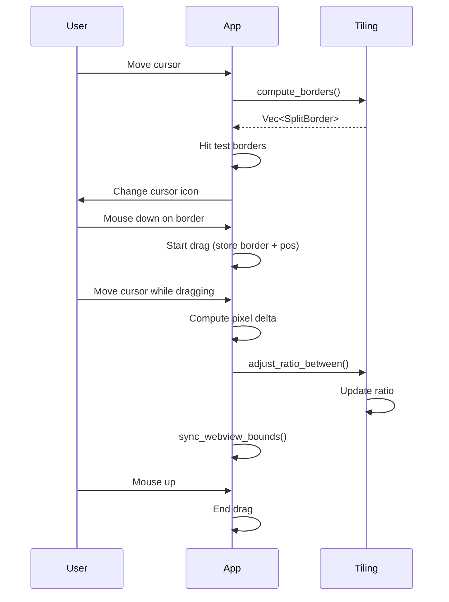
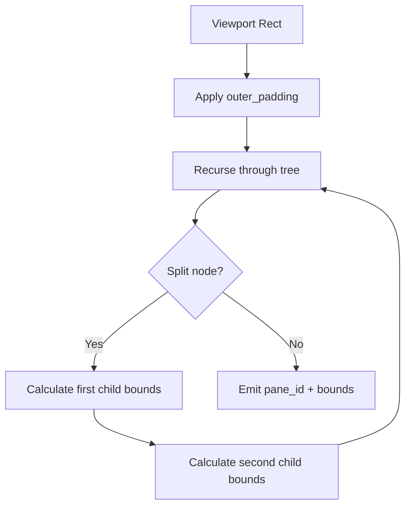
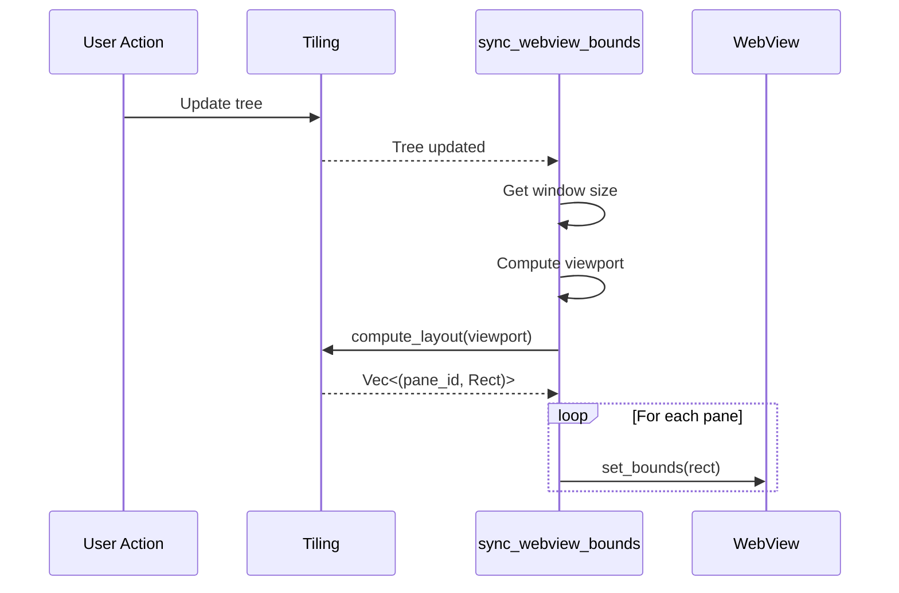

## Overview

Jarvis uses a **binary split tree** to manage pane layout within the application window. Every visible pane occupies a leaf node in the tree, and interior nodes describe how their two children are divided -- either horizontally (side by side) or vertically (top and bottom).

<Info>
  The tiling subsystem (`jarvis-tiling` crate) is intentionally decoupled from rendering and platform windowing, making it a pure-logic system that can be tested independently.
</Info>

## Binary Split Tree

### Data Model

```rust
pub enum SplitNode {
    Leaf { 
        pane_id: u32 
    },
    Split {
        direction: Direction,   // Horizontal or Vertical
        ratio: f64,             // 0.0 .. 1.0, space for first child
        first: Box<SplitNode>,
        second: Box<SplitNode>,
    },
}

pub enum Direction {
    Horizontal,  // Children side by side (left | right)
    Vertical,    // Children stacked (top / bottom)
}
```

### Visual Example

```mermaid
graph TD
    Root["Split(H, 0.5)"] --> L1["Leaf(1)"]
    Root --> R1["Split(V, 0.5)"]
    R1 --> L2["Leaf(2)"]
    R1 --> L3["Leaf(3)"]
    
    style Root fill:#333,stroke:#888
    style R1 fill:#333,stroke:#888
    style L1 fill:#1e3a5f,stroke:#4a90e2
    style L2 fill:#1e3a5f,stroke:#4a90e2
    style L3 fill:#1e3a5f,stroke:#4a90e2
```



This tree produces:

```
+------------------+------------------+
|                  |                  |
|                  |    Pane 2        |
|    Pane 1        |                  |
|                  +------------------+
|                  |                  |
|                  |    Pane 3        |
|                  |                  |
+------------------+------------------+
```

## Core Operations

### Splitting

<Accordion>
  <AccordionItem title="split_at(target_id, new_id, direction)">
    Replace a leaf with a split node:
    
    **Before**:
    ```
    Leaf(1)
    ```
    
    **After** `split_at(1, 2, Horizontal)`:
    ```
    Split(H, 0.5)
     /         \\
    Leaf(1)    Leaf(2)
    ```
    
    The original pane becomes the `first` child, new pane becomes `second`, ratio is `0.5`.
  </AccordionItem>
  
  <AccordionItem title="Auto-split Direction">
    The `auto_split_direction(viewport)` method chooses split direction based on aspect ratio:
    
    - If `width >= height` → `Horizontal` (make both narrower)
    - If `width < height` → `Vertical` (make both shorter)
    
    This keeps panes roughly square-shaped.
  </AccordionItem>
  
  <AccordionItem title="Typed Splits">
    `split_with(direction, kind, title)` creates a pane with specific `PaneKind`:
    
    ```rust
    // Open a Chat pane beside the current one
    tiling.split_with(Direction::Horizontal, PaneKind::Chat, "Chat");
    ```
    
    Available kinds:
    - `Terminal` (default)
    - `Chat`
    - `Assistant`
    - `WebView`
    - `ExternalApp`
  </AccordionItem>
</Accordion>

### Closing Panes

<Accordion>
  <AccordionItem title="remove_pane(target_id)">
    Removes a pane and collapses the tree:
    
    **Before**:
    ```
    Split(H, 0.5)
     /         \\
    Leaf(1)    Leaf(2)
    ```
    
    **After** `remove_pane(2)`:
    ```
    Leaf(1)
    ```
    
    The parent split is replaced by the surviving sibling.
  </AccordionItem>
  
  <AccordionItem title="close_focused()">
    High-level method that:
    1. Gets the focused pane ID
    2. Removes it from the tree
    3. Destroys associated WebView
    4. Updates focus to nearest remaining pane
    
    Cannot close the last pane (requires at least one).
  </AccordionItem>
</Accordion>

### Focus Management

<Accordion>
  <AccordionItem title="focus_next() / focus_prev()">
    Move focus in depth-first order, wrapping around:
    
    ```
    Panes: [1, 2, 3]
    Current focus: 2
    
    focus_next()  → 3
    focus_next()  → 1 (wrapped)
    focus_prev()  → 3 (wrapped)
    ```
  </AccordionItem>
  
  <AccordionItem title="focus_direction(dir)">
    Move focus to neighbor in a specific direction:
    
    - `Horizontal` → move right
    - `Vertical` → move up
    
    Uses linear ordering (DFS) to find the adjacent pane. Does not wrap.
  </AccordionItem>
  
  <AccordionItem title="focus_pane(id)">
    Focus a specific pane by numeric ID:
    
    ```rust
    if tiling.focus_pane(3) {
        println!("Focused pane 3");
    } else {
        println!("Pane 3 does not exist");
    }
    ```
  </AccordionItem>
</Accordion>

### Zoom Mode

<Accordion>
  <AccordionItem title="zoom_toggle()">
    Makes a single pane fill the entire content area:
    
    ```rust
    // First call: zoom focused pane
    tiling.zoom_toggle();
    assert!(tiling.is_zoomed());
    
    // Second call: unzoom
    tiling.zoom_toggle();
    assert!(!tiling.is_zoomed());
    ```
    
    **Behavior**:
    - Requires at least 2 panes
    - Any split operation cancels zoom
    - Closing a pane cancels zoom
    - Only the zoomed pane is visible
  </AccordionItem>
  
  <AccordionItem title="Layout Impact">
    When zoomed, `compute_layout()` short-circuits:
    
    ```rust
    if let Some(zoomed_id) = self.zoomed {
        return vec![(zoomed_id, viewport)];
    }
    ```
    
    All other panes remain at their previous positions (off-screen).
  </AccordionItem>
</Accordion>

## Resizing

### Keyboard Resize

Adjust split ratios with arrow keys:

```rust
pub fn resize(&mut self, direction: Direction, delta: i32) -> bool {
    let delta_f = delta as f64 * 0.05;  // 5% per step
    self.tree.adjust_ratio(self.focused, delta_f)
}
```

**Example**:
```
Initial ratio: 0.5 (50% / 50%)
Resize right (+1): 0.55 (55% / 45%)
Resize right (+1): 0.60 (60% / 40%)
Resize left (-1):  0.55 (55% / 45%)
```

Ratios are clamped to `[0.1, 0.9]` to prevent invisible panes.

### Mouse Drag Resize



#### Split Border Structure

```rust
pub struct SplitBorder {
    pub direction: Direction,  // Axis the split divides
    pub position: f64,         // Pixel position of divider
    pub start: f64,            // Start of divider span
    pub end: f64,              // End of divider span
    pub first_pane: u32,       // Pane ID from first subtree
    pub second_pane: u32,      // Pane ID from second subtree
    pub bounds: Rect,          // Bounding rect of split region
}
```

Each split node produces one border. The `compute_borders()` function walks the tree recursively.

#### Hit Testing

```rust
const HIT_ZONE: f64 = 6.0;  // 6 pixels on each side

for border in borders {
    let dist = match border.direction {
        Horizontal => (cursor.x - border.position).abs(),
        Vertical => (cursor.y - border.position).abs(),
    };
    
    if dist < HIT_ZONE && cursor_in_span(border) {
        return Some(border);
    }
}
```

### Swap Panes

Exchange positions with a neighbor:

```rust
pub fn swap(&mut self, direction: Direction) -> bool {
    if let Some(neighbor) = self.tree.find_neighbor(self.focused, direction) {
        self.tree.swap_panes(self.focused, neighbor)
    } else {
        false
    }
}
```

**Visual Example**:

```
Before swap_panes(1, 2):
    Split(H, 0.5)
     /         \\
   Leaf(1)    Leaf(2)

After:
    Split(H, 0.5)
     /         \\
   Leaf(2)    Leaf(1)
```

The tree structure (directions and ratios) is preserved; only pane IDs swap.

## Layout Engine

### Algorithm

Converts the split tree into pixel rectangles:



### Calculation Details

<Accordion>
  <AccordionItem title="Horizontal Split">
    ```rust
    let available_width = bounds.width - gap;
    let first_width = available_width * ratio;
    let second_width = available_width - first_width;
    
    let first_bounds = Rect {
        x: bounds.x,
        y: bounds.y,
        width: first_width,
        height: bounds.height,
    };
    
    let second_bounds = Rect {
        x: bounds.x + first_width + gap,
        y: bounds.y,
        width: second_width,
        height: bounds.height,
    };
    ```
  </AccordionItem>
  
  <AccordionItem title="Vertical Split">
    ```rust
    let available_height = bounds.height - gap;
    let first_height = available_height * ratio;
    let second_height = available_height - first_height;
    
    let first_bounds = Rect {
        x: bounds.x,
        y: bounds.y,
        width: bounds.width,
        height: first_height,
    };
    
    let second_bounds = Rect {
        x: bounds.x,
        y: bounds.y + first_height + gap,
        width: bounds.width,
        height: second_height,
    };
    ```
  </AccordionItem>
  
  <AccordionItem title="Outer Padding">
    Before recursing, the viewport is inset:
    
    ```rust
    let padded = Rect {
        x: viewport.x + outer_padding,
        y: viewport.y + outer_padding,
        width: viewport.width - outer_padding * 2,
        height: viewport.height - outer_padding * 2,
    };
    ```
  </AccordionItem>
</Accordion>

### Visual Example: Gap and Padding

```
Viewport: 800 x 600
outer_padding = 10
gap = 8

+---------- 800 ----------+
|  padding = 10            |
|  +--- 780 x 580 ------+ |
|  |        |  gap  |    | |
|  | Pane 1 | (8px) | P2 | |
|  |  386   |       |386 | |
|  +--------+-------+----+ |
|                          |
+--------------------------+

Available = 780 - 8 = 772
Each pane = 772 * 0.5 = 386
```

### Configuration

```rust
pub struct LayoutEngine {
    pub gap: u32,            // Pixels between panes
    pub outer_padding: u32,  // Screen-edge padding
    pub min_pane_size: f64,  // Minimum dimension (default 50.0)
}
```

```toml
[layout]
panel_gap = 6          # 0-20 pixels
outer_padding = 0      # 0-40 pixels
```

## Pane Stacks (Tabs)

A single leaf position can host multiple panes as a **stack** (tabbed interface).

### Structure

```rust
pub struct PaneStack {
    panes: Vec<u32>,       // Ordered list of pane IDs
    active_index: usize,   // Index of visible pane
}
```

### Operations

<Accordion>
  <AccordionItem title="push(pane_id)">
    Add a pane to the stack and make it active:
    
    ```rust
    let mut stack = PaneStack::new(1);
    stack.push(2);  // Now showing pane 2
    stack.push(3);  // Now showing pane 3
    
    assert_eq!(stack.active(), 3);
    assert_eq!(stack.pane_ids(), vec![1, 2, 3]);
    ```
  </AccordionItem>
  
  <AccordionItem title="cycle_next() / cycle_prev()">
    Navigate tabs with wrapping:
    
    ```rust
    stack.cycle_next();  // 3 → 1
    stack.cycle_next();  // 1 → 2
    stack.cycle_prev();  // 2 → 1
    ```
  </AccordionItem>
  
  <AccordionItem title="remove(pane_id)">
    Remove a pane from the stack:
    
    ```rust
    stack.remove(2);  // Remove pane 2
    // If 2 was active, previous pane (1) becomes active
    // Cannot remove last pane
    ```
  </AccordionItem>
</Accordion>

### TilingManager Integration

```rust
// Add a new chat pane to the current stack
tiling.push_to_stack(PaneKind::Chat, "Chat Room");

// Cycle through tabs
tiling.cycle_stack_next();
tiling.cycle_stack_prev();
```

## TilingManager API

### State

```rust
pub struct TilingManager {
    tree: SplitNode,                    // Split tree root
    panes: HashMap<u32, Pane>,          // Pane registry
    stacks: HashMap<u32, PaneStack>,    // Tab stacks at leaves
    focused: u32,                       // Currently focused pane
    zoomed: Option<u32>,                // Zoomed pane (if any)
    layout_engine: LayoutEngine,        // Gap, padding, min size
    next_id: u32,                       // Auto-incrementing ID
}
```

### Initialization

```rust
// Create manager with one terminal pane
let mut tiling = TilingManager::new();

// Or with custom layout engine
let engine = LayoutEngine {
    gap: 8,
    outer_padding: 10,
    min_pane_size: 100.0,
};
let mut tiling = TilingManager::with_layout(engine);
```

### Accessors

| Method | Returns |
|--------|----------|
| `focused_id()` | Currently focused pane ID |
| `is_zoomed()` | Whether zoom mode is active |
| `zoomed_id()` | `Some(id)` of zoomed pane |
| `pane_count()` | Total number of panes |
| `pane(id)` | `Option<&Pane>` for given ID |
| `tree()` | Reference to split tree root |
| `gap()` | Current inter-pane gap |
| `outer_padding()` | Current outer padding |
| `ordered_pane_ids()` | Pane IDs in visual order (DFS) |

### Command Dispatch

```rust
pub enum TilingCommand {
    SplitHorizontal,
    SplitVertical,
    Close,
    Resize(Direction, i32),
    Swap(Direction),
    FocusNext,
    FocusPrev,
    FocusDirection(Direction),
    Zoom,
}

// Execute any command
tiling.execute(TilingCommand::SplitHorizontal);
tiling.execute(TilingCommand::Resize(Direction::Horizontal, 2));
```

## WebView Bounds Synchronization

Each pane corresponds to a `wry` WebView that needs position/size updates.

### Sync Pipeline



### When Sync Triggers

- `NewPane` (split + create WebView)
- `ClosePane` (remove pane + destroy WebView)
- `SplitHorizontal` / `SplitVertical`
- `ZoomPane` (toggle zoom)
- `ResizePane` (keyboard resize)
- `SwapPane`
- Mouse drag resize (every cursor move)
- Window resize events

### Coordinate Conversion

```rust
pub fn tiling_rect_to_wry(rect: &Rect) -> wry::Rect {
    wry::Rect {
        position: Position::Logical(LogicalPosition::new(rect.x, rect.y)),
        size: Size::Logical(LogicalSize::new(rect.width, rect.height)),
    }
}
```

## UI Chrome Integration

### Content Rect Calculation

The tiling viewport excludes UI chrome:

```rust
// Get logical window size
let (w, h) = get_logical_window_size();

// Subtract tab bar and status bar
let content = ui_chrome.content_rect(w, h);

// Use as tiling viewport
let layout = tiling.compute_layout(content);
```

### Example

```
Window: 1280 x 800
Tab bar: 32px
Status bar: 24px

Content rect:
  x: 0
  y: 32
  width: 1280
  height: 744  (800 - 32 - 24)
```

## Platform Window Management

The `platform` module provides a `WindowManager` trait for external app windows:

```rust
pub trait WindowManager: Send + Sync {
    fn list_windows(&self) -> Result<Vec<ExternalWindow>>;
    fn set_window_frame(&self, window_id: WindowId, frame: Rect) -> Result<()>;
    fn focus_window(&self, window_id: WindowId) -> Result<()>;
    fn set_minimized(&self, window_id: WindowId, minimized: bool) -> Result<()>;
    fn watch_windows(
        &self,
        callback: Box<dyn Fn(WindowEvent) + Send>
    ) -> Result<WatchHandle>;
}
```

### Platform Support

- **macOS**: CoreGraphics-based implementation
- **Windows / Linux**: Stub implementations (returns `NoopWindowManager`)

### Usage

```rust
let window_mgr = create_window_manager()?;

// List all windows
for window in window_mgr.list_windows()? {
    println!("{}: {}", window.id, window.title);
}

// Tile an external window
let rect = Rect { x: 0.0, y: 0.0, width: 800.0, height: 600.0 };
window_mgr.set_window_frame(window_id, rect)?;
```

## Configuration Reference

```toml
[layout]
panel_gap = 6              # Pixels between panes (0-20)
border_radius = 8          # Corner rounding (0-20)
padding = 10               # Inner pane padding (0-40)
max_panels = 5             # Max simultaneous panels (1-10)
default_panel_width = 0.72 # Default width fraction (0.3-1.0)
scrollbar_width = 3        # Scrollbar width (1-10)
border_width = 0.0         # Pane border width (0.0-3.0)
outer_padding = 0          # Screen-edge padding (0-40)
inactive_opacity = 1.0     # Opacity for unfocused panes (0.0-1.0)

[opacity]
background = 1.0
panel = 0.85
orb = 1.0
hex_grid = 0.8
hud = 1.0
```

## Testing

The tiling crate has comprehensive unit tests:

```bash
# Run all tiling tests
cargo test -p jarvis-tiling

# Run specific test module
cargo test -p jarvis-tiling tree::tests
cargo test -p jarvis-tiling layout::tests
```

### Test Coverage

- Tree operations (split, remove, swap, ratio adjustment, traversal)
- Layout computation (single pane, splits with gap, nested splits)
- Border computation and hit testing
- Stack operations (push, remove, cycle, serialization)
- Manager integration (split/close lifecycle, focus cycling, zoom)

## Next Steps

<CardGroup cols={2}>
  <Card title="Renderer" icon="palette" href="/architecture/renderer">
    GPU rendering pipeline and visual effects
  </Card>
  <Card title="Keybindings" icon="keyboard" href="/configuration/keybindings">
    Configure tiling keybindings
  </Card>
  <Card title="Configuration" icon="sliders" href="/configuration/overview">
    Complete TOML configuration reference
  </Card>
  <Card title="Crates" icon="cubes" href="/architecture/crates">
    Detailed crate documentation
  </Card>
</CardGroup>
